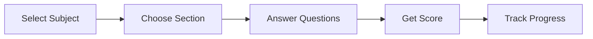

# 🎯 Quiz App for College Mid-Sem

<p align="center">
  
</p>

<p align="center">
  
  
  
</p>

---

## 🌐 Live App

<p align="center">
  <a href="https://charanreddy0006-quiz-app-for-college-midsem--quiz-appapp-o6urdz.streamlit.app/">
    
  </a>
</p>

---

## ✨ What makes this special?

🚀 This isn’t just a quiz app — it’s a **smart exam preparation tool** designed for college mid-sems.

* 📚 Multi-subject support (Java, OS, CN…)
* 🧩 Section-wise structured learning
* 🎯 Difficulty-based practice
* 📊 Real-time progress tracking
* ⚡ Clean & fast UI powered by Streamlit

---

## 🧠 How it works



---

## 🛠️ Tech Stack

<p align="center">
  
</p>

---

## ⚙️ Run Locally

```bash
git clone https://github.com/charanreddy0006/Quiz-App-For-College-Midsem-.git
cd Quiz-App-For-College-Midsem-
pip install -r requirements.txt
streamlit run quiz_app/app.py
```

---

## 🚀 Deployment

Deployed on **Streamlit Community Cloud** for instant access anywhere 🌍

---

## 📸 Preview

<p align="center">
  
</p>

---

## 🔮 Future Enhancements

* 🔐 User Authentication
* 🏆 Leaderboard system
* ⏱️ Timed quizzes
* 🌙 Dark mode UI
* 📱 Mobile-friendly improvements

---

## ⭐ Show some love

If you like this project:

👉 Give it a ⭐ on GitHub
👉 Share with your friends

---

<p align="center">
  
</p>
